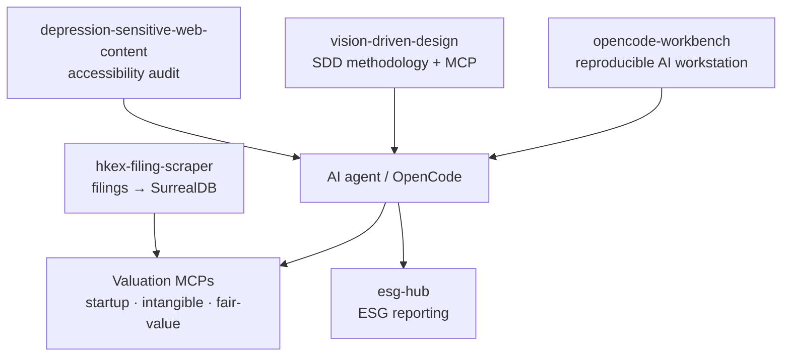

# Simon Mak 麥沛霖

**Entrepreneur. Author. Sustainability Advocate.**

Connecting finance and sustainability — building open-source AI/MCP tooling for ESG, valuation, and accessibility.

I've spent my career at the intersection of finance and sustainability. As a CFA
Charterholder who became Vice Chairman and CEO of Hong Kong's leading
environmental NGO on a pro bono basis, I've learned that lasting change requires
both financial rigor and environmental conviction.

- 🏢 Founder & CEO, [Ascent Partners Group](https://ascent-partners.com) — corporate valuation & ESG advisory (200+ listed companies served)
- 🌏 Founder, Ascent Partners Foundation — conservation across Asia-Pacific
- 🎓 B.Sc. Mathematics & Computer Science, McGill University
- 📜 CFA · CMA · MIPA · Cambridge Institute for Sustainability Leadership
- 🌐 [simonmak.com](https://www.simonmak.com) · [LinkedIn](https://www.linkedin.com/in/simonmak88/)

## Try it in 5 minutes

No install — point any MCP client at a hosted endpoint (Streamable HTTP):

| MCP server | Endpoint |
| --- | --- |
| fair-value | `https://fair-value.ascent-partners.com/mcp` |
| intangible-valuation | `https://intangible-valuation.simonmak.com/api/mcp` |
| hkex-filings | `https://hkex-listco-updates.ascent-partners.com/api/mcp` |
| vision-driven-design | `https://vdd.simonmak.com/api/mcp` |

Or run one locally: `pip install "startup-valuation[mcp]"`.

## How it fits together

## Open source

Practical, rigorous tools for ESG, valuation, accessibility, and AI-agent automation.

| Project | What it is |
| --- | --- |
| [vision-driven-design](https://github.com/simonmak-ascent/vision-driven-design) | Spec-driven development methodology + MCP server (8 phases, 7 gates, bi-directional traceability) |
| [startup-valuation](https://github.com/simonmak-ascent/startup-valuation) | 80+ startup valuation formulas + MCP server + AI-agent skills |
| [intangible-valuation](https://github.com/simonmak-ascent/intangible-valuation) | Intangible-asset valuation library + MCP server |
| [fair-value](https://github.com/simonmak-ascent/fair-value) | IFRS/IVS valuation engine + MCP server (DCF, WACC/FF5, KMV, derivatives) |
| [esg-hub](https://github.com/simonmak-ascent/esg-hub) | ESG knowledge & reporting platform + public API + MCP server |
| [hkex-filing-scraper](https://github.com/simonmak-ascent/hkex-filing-scraper) | HKEx regulatory filings → SurrealDB with PDF extraction & graph linking |
| [opencode-workbench](https://github.com/simonmak-ascent/opencode-workbench) | One-command reproducibility for an AI-agent workstation |
| [depression-sensitive-web-content](https://github.com/simonmak-ascent/depression-sensitive-web-content) | Cognitive accessibility & emotional-safety auditing skill |

> Also private: `valuation-data-mcp` — cited, deterministic valuation inputs for the calculators above (keyed MCP server, read-only over the valuation database).

## MCP servers

Published to the official MCP Registry under `io.github.simonmak-ascent/*`:

`startup-valuation` · `intangible-valuation` · `hkex-filings` · `esg-hub` · `vision-driven-design` · `opencode-workbench`

---

*The bridge between two worlds.*
